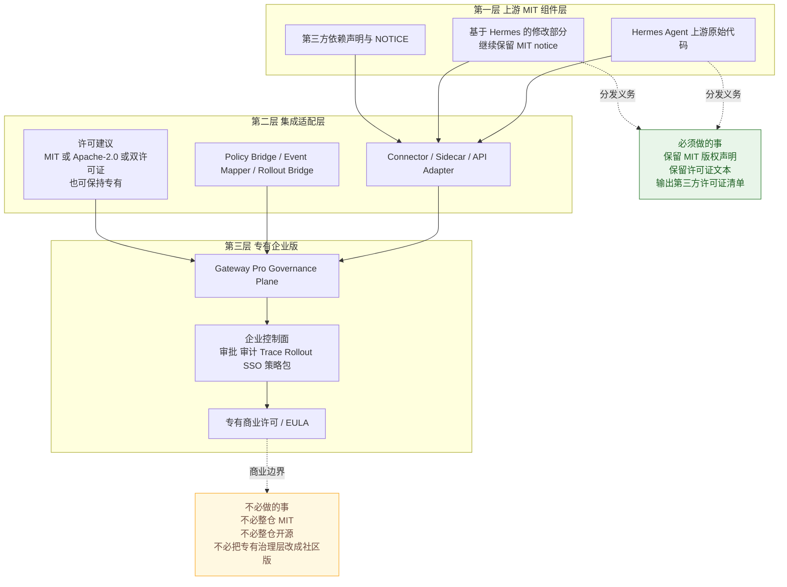

# Hermes Agent × Gateway Pro 推荐许可架构图

## 结论

- 推荐采用三层许可架构：上游 MIT、适配层、专有企业版。
- 最稳的商业路径不是把整套产品统一做成 MIT，而是把上游组件、适配层和企业治理层拆开许可。
- 只要保留 Hermes 上游 MIT 声明与第三方 notice，企业治理平面和商业交付层可以继续保持专有。

## 推荐许可架构图

## 三层怎么理解

### 第一层：上游 MIT 组件层

- 这一层包括 Hermes Agent 原始上游代码，以及你直接修改过并继续分发的 Hermes 部分。
- 这一层最关键的义务不是开源全部产品，而是保留 MIT 对应的版权和许可声明。
- 如果集成版里打包了 Hermes 源码、二进制或其修改版，都要把上游 attribution 留住。

### 第二层：集成适配层

- 这一层是你自己写的连接器、API 适配器、事件桥、审批桥、策略桥、rollout 桥。
- 这层最灵活，可以专有，也可以 MIT，也可以 Apache-2.0，也可以做双许可证。
- 如果你想做生态合作版，把这一层开放最合适；如果你想把核心控制权抓在自己手里，也可以闭源。

### 第三层：专有企业版

- 这一层是 Gateway Pro 本身的治理控制平面，以及企业专属的审批、审计、SSO、通知、策略包、交付资产。
- 这一层最适合维持专有商业许可。
- 它是你的商业护城河，不需要为了兼容 MIT 上游而被动开源。

## 推荐的对外许可策略

| 层 | 推荐策略 | 原因 |
| --- | --- | --- |
| 上游 MIT 组件层 | 保留 MIT 与 notice | 满足上游分发义务 |
| 集成适配层 | Apache-2.0 或 MIT 或双许可证 | 便于生态扩展，边界清晰 |
| 专有企业版 | 商业许可 / EULA | 保留商业控制权与交付壁垒 |

## 最稳的商业分发方式

### 方案 A：闭源企业版主线

- Hermes 作为第三方 MIT 组件被引用或打包。
- 适配层最小化开放，治理层全部专有。
- 对外附带第三方许可证清单与 NOTICE 文件。

这是最适合你当前 Gateway Pro 路线的主方案。

### 方案 B：社区连接器 + 企业治理版

- 把 connector、SDK、bridge 这一层开放出来。
- 用 MIT 或 Apache-2.0 吸引生态接入。
- Gateway Pro 治理平面和企业交付层继续闭源。

这是更适合做生态扩张的方案。

## 你至少要补的三个法务交付件

1. Gateway Pro 自身的明确许可文本或 EULA。
2. Hermes 与其他第三方依赖的许可证清单。
3. 集成版分发包中的 NOTICE / attribution 文件。

## 最终建议

- 许可架构上，不建议把整套产品简单做成单一 MIT。
- 更建议采用“三层分治”：上游 MIT、适配层灵活、企业版专有。
- 这样既能合法纳入 Hermes，又不会把你的企业治理资产白白让渡成纯社区公共品。
